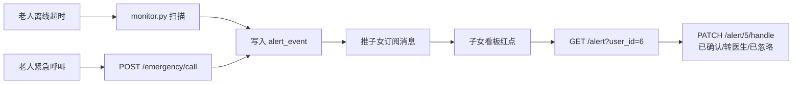

# 一、老人端接口文档

> 模糊视觉辅助问答系统 — 老人端微信小程序  
> 服务地址：`http://127.0.0.1:8090` | Swagger：`http://127.0.0.1:8090/docs`

---

## 1. 基础约定

### 1.1 统一响应格式

所有业务接口返回：

```json
{"code": 0, "msg": "ok", "data": {...}}
```

- `code=0` 成功，非 0 失败
- HTTP 异常（401/403/404 等）返回 `{"detail": "错误描述"}`

### 1.2 鉴权

除 `/auth/wx-login` 外，所有接口 Header 携带：

```
Authorization: Bearer <token>
```

token 由登录接口返回，有效期 30 分钟。

### 1.3 错误码速查

| HTTP 状态码 | 含义 | 常见原因 |
|:----------:|------|---------|
| 200 | 成功 | — |
| 400 | 参数错误 | 必填字段缺失、文件格式不支持 |
| 401 | 未认证 | token 缺失/过期 |
| 403 | 权限不足 | 子女端 token 调老人端接口 |
| 404 | 不存在 | 资源未找到 |
| 500 | 服务器错误 | 大模型调用失败、图像处理异常 |

---

## 2. 接口清单

| # | 方法 | 路径 | 说明 | 鉴权 |
|:--:|------|------|------|:----:|
| 1 | POST | `/api/v1/auth/wx-login` | 微信登录 | 否 |
| 2 | POST | `/api/v1/auth/heartbeat` | 心跳上报 | 老人 |
| 3 | POST | `/api/v1/media/upload/image` | 拍照上传 | 是 |
| 4 | POST | `/api/v1/media/upload/voice` | 录音上传 | 是 |
| 5 | POST | `/api/v1/qa/ask` | 问答 | 老人 |
| 6 | GET | `/api/v1/qa/history` | 历史查询 | 老人 |
| 7 | POST | `/api/v1/alert/emergency/call` | 一键紧急呼叫 | 老人 |
| 8 | GET | `/api/v1/reminder/medication` | 用药提醒 | 老人 |

---

## 3. 接口详情

### 3.1 微信登录 `POST /api/v1/auth/wx-login`

**调用时机**：小程序启动时，`wx.login()` 拿到 code 后调用。

**请求体**

```json
{
  "code": "wx.login()返回的code",
  "user_type": "user"
}
```

| 参数 | 类型 | 必填 | 说明 |
|------|------|:----:|------|
| code | string | 是 | 小程序 `wx.login()` 返回的临时凭证 |
| user_type | string | 否 | 固定 `"user"`（老人端） |

**dev 模式**：code 传任意字符串即可，不调微信。  
**prod 模式**：code 是 `wx.login()` 返回的真实凭证，5 分钟有效。

**响应**

```json
{
  "code": 0,
  "msg": "ok",
  "data": {
    "token": "eyJhbGciOi...",
    "refresh_token": "eyJhbGciOi...",
    "token_type": "Bearer",
    "user_type": "user",
    "ref_id": 6,
    "nickname": "老人6"
  }
}
```

| 字段 | 说明 |
|------|------|
| token | 访问令牌，30 分钟有效 |
| refresh_token | 刷新令牌，7 天有效 |
| ref_id | 老人 ID（后续接口凭此标识用户） |
| nickname | 昵称 |

---

### 3.2 心跳上报 `POST /api/v1/auth/heartbeat`

**调用时机**：小程序前台运行时 **每 30 秒** 调用一次，证明在线。

**请求**：无 body，仅需 Header 携带 token。

**响应**

```json
{
  "code": 0,
  "msg": "ok",
  "data": {
    "heartbeat_at": "2026-06-29T09:00:00Z",
    "online_status": "online"
  }
}
```

**前端实现**：`setInterval(() => { request(...) }, 30000)`  
**后端行为**：超过 180 秒未收到心跳，自动触发"网络断开"预警通知子女端。

---

### 3.3 拍照上传 `POST /api/v1/media/upload/image`

**调用时机**：老人拍照或从相册选择图片后。

**请求**：`multipart/form-data`

| 参数 | 类型 | 必填 | 说明 |
|------|------|:----:|------|
| file | file | 是 | 图片文件，格式 jpg/jpeg/png/bmp/webp，≤10MB |

**响应**

```json
{
  "code": 0,
  "msg": "ok",
  "data": {
    "media_id": "img_20260629_100000_a1b2c3",
    "url": "/files/img_20260629_100000_a1b2c3.jpg",
    "enhanced_url": "/files/img_20260629_100000_a1b2c3_enhanced.jpg",
    "filename": "photo.jpg",
    "size": 102400,
    "width": 1920,
    "height": 1080,
    "operations": ["gamma_1.3"],
    "uploaded_at": "2026-06-29T10:00:00Z"
  }
}
```

| 字段 | 说明 |
|------|------|
| media_id | 媒体唯一 ID |
| url | **原图** URL（图片访问地址：`http://host:port/files/xxx.jpg`） |
| enhanced_url | **增强后图** URL（Gamma 校正，亮度提升，**询问大模型时传这个**） |
| operations | 执行的增强操作（当前固定 `["gamma_1.3"]`） |

**前端实现**

```javascript
wx.chooseImage({ count: 1, success: (res) => {
  wx.uploadFile({
    url: 'http://host:8090/api/v1/media/upload/image',
    filePath: res.tempFilePaths[0],
    name: 'file',
    header: { 'Authorization': 'Bearer ' + token },
    success: (resp) => {
      const data = JSON.parse(resp.data).data;
      // 保存 enhanced_url，下一步传给问答接口
      this.enhancedUrl = data.enhanced_url;
    }
  });
}});
```

---

### 3.4 录音上传 `POST /api/v1/media/upload/voice`

**调用时机**：老人录音后。

**请求**：`multipart/form-data`

| 参数 | 类型 | 必填 | 说明 |
|------|------|:----:|------|
| file | file | 是 | 语音文件，格式 wav/mp3/m4a/aac/amr，≤25MB |

**响应**

```json
{
  "code": 0,
  "msg": "ok",
  "data": {
    "media_id": "voice_20260629_100000_d4e5f6",
    "url": "/files/voice_20260629_100000_d4e5f6.wav",
    "filename": "recording.wav",
    "size": 204800,
    "asr_text": "我今天头疼该吃什么药",
    "uploaded_at": "2026-06-29T10:00:00Z"
  }
}
```

| 字段 | 说明 |
|------|------|
| url | 语音文件 URL |
| asr_text | **语音转写文本**（faster-whisper 自动识别），直接用于问答 |

**前端实现**

```javascript
wx.getRecorderManager().onStop((res) => {
  wx.uploadFile({
    url: 'http://host:8090/api/v1/media/upload/voice',
    filePath: res.tempFilePath,
    name: 'file',
    header: { 'Authorization': 'Bearer ' + token },
    success: (resp) => {
      const data = JSON.parse(resp.data).data;
      // 吐司显示转写结果
      this.setData({ questionText: data.asr_text });
    }
  });
});
```

---

### 3.5 智能问答 `POST /api/v1/qa/ask`

**调用时机**：老人输入文本/拍照/录音后，提交问题。

**请求体**

```json
{
  "input_type": "image",
  "text": "这是什么药？怎么吃？",
  "media_url": "/files/img_xxx_enhanced.jpg",
  "session_id": null
}
```

| 参数 | 类型 | 必填 | 说明 |
|------|------|:----:|------|
| input_type | string | 否 | `text`（默认）/ `image` / `voice` |
| text | string | 条件 | 文本内容。image/voice 时可做补充说明 |
| media_url | string | 条件 | 图片用 `enhanced_url`，语音用 `asr_text` 即可不传 |
| session_id | string | 否 | 不传自动生成新会话 |

**响应**

```json
{
  "code": 0,
  "msg": "ok",
  "data": {
    "msg_id": 1,
    "session_id": "sess_20260629_a1b2c3",
    "answer": "喵~这是一盒布洛芬缓释胶囊，用于缓解头痛、牙痛...",
    "intercepted": true,
    "risk_tags": ["药品", "布洛芬"],
    "latency_ms": 1523,
    "cat_action": "speak",
    "alert_signal": null
  }
}
```

| 字段 | 说明 |
|------|------|
| answer | 大模型回答文本，直接展示 |
| intercepted | 是否触发医疗合规（涉药问题追加了免责声明） |
| risk_tags | 命中的风险标签（供前端展示"仅供参考"提示） |
| latency_ms | 调用耗时 |
| cat_action | 小猫动画状态：`listen`/`think`/`speak` |
| alert_signal | 预警信号：`null` 表示无预警；非 null 时格式 `{alert_type, alert_level, detail}` |

**小猫动画建议**

| cat_action | 动画 |
|-----------|------|
| listen | 小猫歪头听 |
| think | 小猫思考/转圈 |
| speak | 小猫张嘴说话 |

**典型调用**

```javascript
// 文本问答
fetch('/api/v1/qa/ask', {
  method: 'POST',
  headers: { 'Content-Type': 'application/json', 'Authorization': 'Bearer ' + token },
  body: JSON.stringify({ input_type: 'text', text: '布洛芬怎么吃' })
});

// 图片问答（先上传拿到 enhanced_url）
fetch('/api/v1/qa/ask', {
  method: 'POST',
  headers: { 'Content-Type': 'application/json', 'Authorization': 'Bearer ' + token },
  body: JSON.stringify({ input_type: 'image', text: '这是什么药', media_url: enhancedUrl })
});

// 语音问答（上传后拿到 asr_text，当文本问答调用）
fetch('/api/v1/qa/ask', {
  method: 'POST',
  headers: { 'Content-Type': 'application/json', 'Authorization': 'Bearer ' + token },
  body: JSON.stringify({ input_type: 'text', text: asrText })
});
```

---

### 3.6 历史查询 `GET /api/v1/qa/history`

**调用时机**：老人查看历史问答记录。

**Query 参数**

| 参数 | 类型 | 必填 | 说明 |
|------|------|:----:|------|
| page | int | 否 | 页码，默认 1 |
| page_size | int | 否 | 每页条数，默认 20 |
| input_type | string | 否 | 筛选：`text` / `image` / `voice` |
| keyword | string | 否 | 模糊匹配问题+回答 |
| start_date | string | 否 | 开始日期 `YYYY-MM-DD` |
| end_date | string | 否 | 结束日期 `YYYY-MM-DD` |

**响应**

```json
{
  "code": 0,
  "msg": "ok",
  "data": {
    "total": 10,
    "page": 1,
    "page_size": 20,
    "items": [
      {
        "msg_id": 1,
        "session_id": "sess_xxx",
        "input_type": "text",
        "content_text": "布洛芬怎么吃",
        "content_media_url": null,
        "answer_text": "喵~布洛芬是饭后吃的哦...",
        "intercepted": true,
        "created_at": "2026-06-29T10:00:00Z"
      }
    ]
  }
}
```

---

### 3.7 一键紧急呼叫 `POST /api/v1/alert/emergency/call`

**调用时机**：老人点击紧急按钮。

**请求**：无 body。

**响应**

```json
{
  "code": 0,
  "msg": "ok",
  "data": {
    "alert_id": 5,
    "alert_time": "2026-06-29T09:00:00Z"
  }
}
```

**后端行为**：写预警记录 → 推送所有绑定子女的订阅消息 → 30s 未确认升级为短信 → 60s 未确认升级为电话。

**前端建议**：点击后弹窗"已通知家人，请等待"，同时展示拨打 120 按钮。

---

### 3.8 用药提醒 `GET /api/v1/reminder/medication`

**调用时机**：老人查看今天该吃什么药。

**请求**：无 body。

**响应**

```json
{
  "code": 0,
  "msg": "ok",
  "data": [
    {"reminder_id": 1, "drug_name": "硝苯地平", "dosage": "1片", "remind_time": "08:00"},
    {"reminder_id": 2, "drug_name": "阿司匹林", "dosage": "1片", "remind_time": "12:00"},
    {"reminder_id": 3, "drug_name": "降压药", "dosage": "半片", "remind_time": "20:00"}
  ]
}
```

| 字段 | 说明 |
|------|------|
| drug_name | 药品名称 |
| dosage | 剂量 |
| remind_time | 提醒时间 `HH:MM`，按时间排序 |

---

## 4. 典型使用流程

### 4.1 启动 → 登录 → 心跳

```
1. wx.login() 拿 code
2. POST /auth/wx-login {code, user_type:"user"} → 拿到 token + ref_id
3. setInterval(() => POST /auth/heartbeat, 30000)
```

### 4.2 拍照问药

```
1. wx.chooseImage → POST /media/upload/image → 拿到 enhanced_url
2. 展示小猫"listen"动画
3. POST /qa/ask {input_type:"image", text:"这是什么药", media_url: enhanced_url}
4. 收到回答 → 展示小猫"speak"动画 + 文字 + 语音播报
```

### 4.3 语音问问题

```
1. wx.getRecorderManager().start()
2. 老人说话 → .stop()
3. POST /media/upload/voice → 拿到 asr_text
4. 吐司展示 asr_text 让老人确认（播放按钮可回听）
5. POST /qa/ask {input_type:"text", text: asr_text}
6. 收到回答 → 展示 + 语音播报
```

### 4.4 紧急呼叫

```
1. 老人点击红色紧急按钮
2. POST /alert/emergency/call
3. 弹窗："已通知家人，请等待。紧急情况请拨打 120。"
4. [大按钮] 拨打 120
```

### 4.5 首页展示

```
启动后展示卡片：
┌──────────────────────┐
│   📷  拍照问药        │  → 跳转拍照 → 上传 → 问答
│   🎤  语音提问        │  → 跳转录音 → 上传 → 问答
│   ✏️  打字问问题       │  → 文本输入 → 问答
│   📋  用药提醒 (3项)   │  → GET /reminder/medication
│   📜  历史记录         │  → GET /qa/history
│   🆘  紧急呼叫         │  → POST /alert/emergency/call
└──────────────────────┘
```

---

## 5. 前端实现要点

### 5.1 token 管理

```javascript
// 登录
const { token, refresh_token, ref_id } = await login();

// 请求拦截器
const request = (url, options = {}) => {
  return fetch(url, {
    ...options,
    headers: { ...options.headers, 'Authorization': 'Bearer ' + token }
  });
};

// token 过期自动刷新
if (resp.status === 401) {
  const { token: newToken } = await fetch('/api/v1/auth/refresh', {
    method: 'POST',
    body: JSON.stringify({ refresh_token })
  });
  token = newToken;
  // 重试原请求
}
```

### 5.2 心跳

```javascript
// 小程序 onShow 启动，onHide 暂停
let heartbeatTimer = null;
Page({
  onShow() {
    this.sendHeartbeat(); // 立即发一次
    heartbeatTimer = setInterval(() => this.sendHeartbeat(), 30000);
  },
  onHide() {
    clearInterval(heartbeatTimer);
  },
  sendHeartbeat() {
    request('/api/v1/auth/heartbeat', { method: 'POST' });
  }
});
```

### 5.3 问答 UI 状态机

```
用户提问 → cat_action="listen" (小猫歪头)
         → cat_action="think"  (小猫思考动画)
         → 收到回答 → cat_action="speak" (小猫说话)
```

### 5.4 图片访问

上传返回的 `url` / `enhanced_url` 是相对路径（如 `/files/img_xxx.jpg`）。展示时拼接：

```javascript
const BASE_URL = 'http://127.0.0.1:8090'; // 生产环境改为实际域名
const imageUrl = BASE_URL + item.content_media_url;
```

### 5.5 适老化 UI 建议

- 字体 ≥ 32rpx（老人视力差）
- 大按钮，间距 ≥ 40rpx
- 语音播报所有文字（`wx.createInnerAudioContext` 或 TTS）
- 紧急呼叫按钮始终在页面底部固定，红色

---

## 6. 接口速查卡

```
登录      POST /auth/wx-login         {code, user_type:"user"}
心跳      POST /auth/heartbeat        -
拍照      POST /media/upload/image    FormData{file}
录音      POST /media/upload/voice    FormData{file}
问答      POST /qa/ask                {input_type, text, media_url?}
历史      GET  /qa/history            ?page=1&page_size=20
紧急      POST /alert/emergency/call  -
用药      GET  /reminder/medication   -
```

---

# 二、子女端接口文档

> 模糊视觉辅助问答系统 — 子女端微信小程序  
> 服务地址：`http://10.242.5.159:8090` | Swagger：`http://10.242.5.159:8090/docs`

---

## 1. 基础约定

### 1.1 统一响应格式

```json
{"code": 0, "msg": "ok", "data": {...}}
```

- `code=0` 成功，非 0 失败
- HTTP 异常返回 `{"detail": "错误描述"}`

### 1.2 鉴权

除 `/auth/wx-login` 外，所有接口 Header 携带：

```
Authorization: Bearer <token>
```

子女端 token 由登录接口返回（`user_type=child`），有效期 30 分钟。
**所有 `/child/*` 接口仅子女端可调**，老人端 token 会返回 403。

### 1.3 错误码

| HTTP | 含义       | 常见原因                |
| :--: | ---------- | ----------------------- |
| 200  | 成功       | —                       |
| 400  | 参数错误   | 必填字段缺失            |
| 401  | 未认证     | token 缺失/过期         |
| 403  | 权限不足   | 老人端 token 调子女接口 |
| 404  | 不存在     | 老人未绑定、资源未找到  |
| 409  | 冲突       | 已绑定该老人            |
| 500  | 服务器错误 | 数据库异常              |

---

## 2. 接口清单

|  #   | 方法   | 路径                                         | 说明               | 鉴权 |
| :--: | ------ | -------------------------------------------- | ------------------ | :--: |
|  1   | POST   | `/api/v1/auth/wx-login`                      | 子女登录           |  否  |
|  2   | POST   | `/api/v1/child/bind`                         | 绑定老人           | 子女 |
|  3   | DELETE | `/api/v1/child/unbind/{user_id}`             | 解绑老人           | 子女 |
|  4   | GET    | `/api/v1/child/binded-users`                 | 我的老人列表       | 子女 |
|  5   | GET    | `/api/v1/child/dashboard/{user_id}`          | 健康看板           | 子女 |
|  6   | GET    | `/api/v1/child/messages/{user_id}`           | 问答记录下钻       | 子女 |
|  7   | GET    | `/api/v1/child/settings/{user_id}`           | 查看配置           | 子女 |
|  8   | PUT    | `/api/v1/child/settings/{user_id}`           | 下发配置           | 子女 |
|  9   | GET    | `/api/v1/child/settings/{user_id}/changes`   | 配置变更历史       | 子女 |
|  10  | GET    | `/api/v1/alert`                              | 预警列表（待实现） | 子女 |
|  11  | PATCH  | `/api/v1/alert/{alert_id}/handle`            | 处置预警（待实现） | 子女 |
|  12  | GET    | `/api/v1/reminder/medication/list?user_id=6` | 用药提醒列表       | 子女 |
|  13  | POST   | `/api/v1/reminder/medication`                | 新增用药提醒       | 子女 |
|  14  | PUT    | `/api/v1/reminder/medication/{id}`           | 修改/停用提醒      | 子女 |
|  15  | DELETE | `/api/v1/reminder/medication/{id}`           | 删除用药提醒       | 子女 |
|  16  | GET    | `/api/v1/memory`                             | 知识库（画像复用） | 子女 |
|  17  | POST   | `/api/v1/memory`                             | 新增知识条目       | 子女 |
|  18  | DELETE | `/api/v1/memory/{id}`                        | 删除知识条目       | 子女 |

---

## 3. 接口详情

### 3.1 子女登录 `POST /api/v1/auth/wx-login`

同老人端文档，`user_type` 传 `"child"`。

**请求体**

```json
{"code": "child_001", "user_type": "child"}
```

**dev 模式**：code 传任意字符串，同一个 code 永远登录同一个子女账号，换 code 换账号。

**响应**

```json
{
  "code": 0, "msg": "ok",
  "data": {
    "token": "eyJhbGciOi...",
    "refresh_token": "eyJhbGciOi...",
    "token_type": "Bearer",
    "user_type": "child",
    "ref_id": 5,
    "nickname": "子女5"
  }
}
```

| 字段   | 说明                                                         |
| ------ | ------------------------------------------------------------ |
| ref_id | 子女自身的 ID（**不是老人 ID**，用于后续 /child/* 接口鉴权） |

---

### 3.2 绑定老人 `POST /api/v1/child/bind`

**调用时机**：首次使用或添加新老人。

**请求体**

```json
{"user_id": 6, "relation": "母亲"}
```

| 参数     | 类型   | 必填 | 说明                                   |
| -------- | ------ | :--: | -------------------------------------- |
| user_id  | int    |  是  | 老人 ID（老人端登录后展示在个人页）    |
| relation | string |  否  | 关系，默认"子女"，如"母亲""父亲""奶奶" |

**响应**

```json
{"code": 0, "msg": "绑定成功", "data": {"user_id": 6, "relation": "母亲"}}
```

**后端逻辑**：写入 `user_child_relation` 表。重复绑定返回 409。

---

### 3.3 解绑老人 `DELETE /api/v1/child/unbind/{user_id}`

```json
{"code": 0, "msg": "已解绑", "data": null}
```

**后端逻辑**：删除 `user_child_relation` 对应行。未绑定返回 404。

---

### 3.4 我的老人列表 `GET /api/v1/child/binded-users`

**调用时机**：子女进入主页，多老人切换列表。

**响应**

```json
{
  "code": 0, "msg": "ok",
  "data": [
    {
      "user_id": 6,
      "nickname": "老人6",
      "relation": "母亲",
      "is_online": true,
      "last_heartbeat_at": "2026-06-30T08:30:00Z",
      "unread_alerts": 2,
      "today_qa_count": 5
    }
  ]
}
```

| 字段              | 说明                                |
| ----------------- | ----------------------------------- |
| is_online         | 在线状态（3 分钟内有心跳为 online） |
| last_heartbeat_at | 最后心跳时间，null 表示从未在线     |
| unread_alerts     | 待处理预警数                        |
| today_qa_count    | 今日问答次数                        |

**后端逻辑**：

1. 查 `user_child_relation` WHERE child_id = 当前子女
2. JOIN `user` 拿昵称、心跳、在线状态
3. 聚合 `alert_event` 待处理数 + `message` 今日问答数

---

### 3.5 健康看板 `GET /api/v1/child/dashboard/{user_id}`

**调用时机**：子女选择某位老人后进入看板首页。

**响应**

```json
{
  "code": 0, "msg": "ok",
  "data": {
    "user_id": 6,
    "nickname": "老人6",
    "is_online": true,
    "today_qa_count": 5,
    "pending_alerts": 2,
    "active_reminders": 3,
    "recent_messages": [
      {
        "msg_id": 15,
        "question": "我今天头疼吃什么药",
        "answer": "喵~建议先休息...",
        "time": "2026-06-30T08:25:00Z"
      }
    ],
    "health_tags": ["有待处理预警"]
  }
}
```

**后端逻辑**：

1. 校验绑定关系
2. `message` COUNT 今日问答数
3. `alert_event` COUNT 待处理预警
4. `medication_reminder` COUNT 活跃提醒
5. `message` ORDER BY created_at DESC LIMIT 3 → 最近 3 条回答

---

### 3.6 问答记录下钻 `GET /api/v1/child/messages/{user_id}`

**调用时机**：子女从看板点击"问答记录"。

**Query 参数**

| 参数       | 类型   | 必填 | 说明                  |
| ---------- | ------ | :--: | --------------------- |
| page       | int    |  否  | 页码，默认 1          |
| page_size  | int    |  否  | 每页条数，默认 20     |
| keyword    | string |  否  | 模糊搜索问题和回答    |
| start_date | string |  否  | 开始日期 `YYYY-MM-DD` |
| end_date   | string |  否  | 结束日期 `YYYY-MM-DD` |

**响应**

```json
{
  "code": 0, "msg": "ok",
  "data": {
    "total": 52,
    "page": 1,
    "page_size": 20,
    "items": [
      {
        "msg_id": 15,
        "input_type": "text",
        "question": "布洛芬怎么吃",
        "answer": "喵~布洛芬是饭后吃的...",
        "intercepted": true,
        "risk_tags": ["药品", "布洛芬"],
        "created_at": "2026-06-30T08:00:00Z"
      }
    ]
  }
}
```

**后端逻辑**：分页查 `message` 表，支持 keyword LIKE 模糊匹配和多字段筛选。

---

### 3.7 查看配置 `GET /api/v1/child/settings/{user_id}`

**调用时机**：子女查看老人的当前适老化设置。

**响应**

```json
{
  "code": 0, "msg": "ok",
  "data": {
    "font_size": "normal",
    "voice_enabled": true,
    "simplified_mode": false
  }
}
```

| 字段            | 类型   | 可选值                  | 说明         |
| --------------- | ------ | ----------------------- | ------------ |
| font_size       | string | normal / large / xlarge | 字体大小     |
| voice_enabled   | bool   | true / false            | 语音播报回答 |
| simplified_mode | bool   | true / false            | 极简模式     |

---

### 3.8 下发配置 `PUT /api/v1/child/settings/{user_id}`

**调用时机**：子女远程调整老人端显示。

**请求体**

```json
{"font_size": "xlarge", "voice_enabled": true, "simplified_mode": false}
```

**响应**

```json
{"code": 0, "msg": "配置已更新", "data": {...}}
```

**后端逻辑**：

1. 逐字段比较 `user_setting` 表，有变化才更新
2. 每次变更写入 `setting_change`（child_id / setting_key / old_value / new_value）
3. 标记 `synced_at` 时间戳

---

### 3.9 配置变更历史 `GET /api/v1/child/settings/{user_id}/changes`

**调用时机**：查看谁改了什么设置。

**响应**

```json
{
  "code": 0, "msg": "ok",
  "data": [
    {
      "change_id": 3,
      "setting_key": "font_size",
      "old_value": "normal",
      "new_value": "xlarge",
      "change_time": "2026-06-30T09:15:00Z",
      "changed_by": 5
    }
  ]
}
```

**后端逻辑**：查 `setting_change` WHERE user_id = X，按 change_time DESC，最多 50 条。

---

### 3.10 预警列表 `GET /api/v1/alert?user_id={user_id}`

**调用时机**：从看板预警数字点击进入。

**Query 参数**

| 参数             | 类型   | 必填 | 说明                                    |
| ---------------- | ------ | :--: | --------------------------------------- |
| user_id          | int    |  是  | 老人 ID                                 |
| status           | string |  否  | 筛选：待处理 / 已确认 / 转医生 / 已忽略 |
| level            | string |  否  | 筛选：提醒 / 警告 / 紧急                |
| page / page_size | int    |  否  | 分页                                    |

**响应**

```json
{
  "code": 0, "msg": "ok",
  "data": {
    "total": 2,
    "items": [
      {
        "alert_id": 5,
        "alert_type": "紧急呼叫",
        "alert_level": "紧急",
        "detail": "老人主动发起紧急呼叫",
        "handling_status": "待处理",
        "alert_time": "2026-06-30T08:00:00Z"
      },
      {
        "alert_id": 3,
        "alert_type": "网络断开",
        "alert_level": "警告",
        "detail": "老人已离线超过3分钟",
        "handling_status": "待处理",
        "alert_time": "2026-06-30T07:30:00Z"
      }
    ],
    "page": 1,
    "page_size": 20
  }
}
```

> **注意**：此接口待实现。当前 `alert.py` 仅有 `POST /alert/emergency/call`。

---

### 3.11 处置预警 `PATCH /api/v1/alert/{alert_id}/handle`

**调用时机**：子女查看预警后点击"已处理"/"已联系"/"转医生"。

**请求体**

```json
{
  "handling_status": "已确认",
  "handle_remark": "已电话确认，老人安全"
}
```

**响应**

```json
{"code": 0, "msg": "已处理", "data": {...}}
```

**后端逻辑**：更新 `alert_event.handling_status` + `handled_by` + `handle_remark` + `handled_at`。

> **注意**：此接口待实现。

---

### 3.12 知识库（健康画像复用）

健康画像通过知识库 CRUD 实现，不设独立接口。

**查询已有画像**：`GET /api/v1/memory?user_id=6&memory_type=健康`

```json
{
  "code": 0, "data": {
    "items": [
      {"memory_id": 1, "content": "对青霉素过敏", "memory_type": "健康", "importance": 5},
      {"memory_id": 2, "content": "患有高血压", "memory_type": "健康", "importance": 4}
    ]
  }
}
```

**新增**：`POST /api/v1/memory`

```json
{"user_id": 6, "memory_type": "健康", "content": "对青霉素过敏", "importance": 5}
```

**删除**：`DELETE /api/v1/memory/{memory_id}`

详见 `08-老人端接口文档.md` 3.11-3.15 节（memory 模块文档）。

---

### 3.13 用药提醒列表 `GET /api/v1/reminder/medication/list?user_id={user_id}`

**调用时机**：子女从看板进入"用药提醒"页。

**Query 参数**

| 参数    | 类型 | 必填 | 说明    |
| ------- | ---- | :--: | ------- |
| user_id | int  |  是  | 老人 ID |

**响应**

```json
{
  "code": 0, "msg": "ok",
  "data": [
    {"reminder_id": 1, "user_id": 6, "drug_name": "硝苯地平", "dosage": "1片", "remind_time": "08:00", "active": 1},
    {"reminder_id": 2, "user_id": 6, "drug_name": "阿司匹林", "dosage": "1片", "remind_time": "12:00", "active": 1}
  ]
}
```

---

### 3.14 新增用药提醒 `POST /api/v1/reminder/medication`

**调用时机**：子女为老人添加新药品。

**Query 参数**

| 参数        | 类型   | 必填 | 说明             |
| ----------- | ------ | :--: | ---------------- |
| user_id     | int    |  是  | 老人 ID          |
| drug_name   | string |  是  | 药品名称         |
| remind_time | string |  是  | 提醒时间 `HH:MM` |
| dosage      | string |  否  | 每次剂量         |

**响应**

```json
{"code": 0, "msg": "已添加", "data": {"reminder_id": 3, "drug_name": "布洛芬", "dosage": "1粒", "remind_time": "20:00", "active": 1}}
```

---

### 3.15 修改/停用提醒 `PUT /api/v1/reminder/medication/{reminder_id}`

**调用时机**：改剂量、改时间、停用某药品。

**Query 参数**（全部可选，传哪些改哪些）

| 参数        | 类型   | 说明             |
| ----------- | ------ | ---------------- |
| drug_name   | string | 药品名           |
| remind_time | string | 提醒时间 `HH:MM` |
| dosage      | string | 剂量             |
| active      | int    | 1=启用, 0=停用   |

**示例：停用**

```
PUT /reminder/medication/3?active=0
```

**响应**

```json
{"code": 0, "msg": "已更新", "data": {...}}
```

---

### 3.16 删除提醒 `DELETE /api/v1/reminder/medication/{reminder_id}`

```json
{"code": 0, "msg": "已删除", "data": null}
```

> **安全**：删除前会校验子女是否绑定了该提醒所属老人。未绑定返回 404。

---

## 4. 核心调用流程

### 4.1 首次使用：登录 → 绑定 → 看板

```
1. wx.login() → POST /auth/wx-login {code, user_type:"child"} → 拿到 token
2. POST /child/bind {user_id: 6, relation: "母亲"}
3. GET /child/binded-users → 展示老人列表
4. 点击"母亲" → GET /child/dashboard/6 → 展示看板
```

### 4.2 日常查看

```
看板首页
│
├─ [问答记录] → GET /child/messages/6?keyword=药&page=1
├─ [远程配置] → GET /child/settings/6 → PUT /child/settings/6
├─ [用药提醒] → GET /reminder/medication/list?user_id=6
│   ├─ [添加]  → POST /reminder/medication?user_id=6&drug_name=..
│   ├─ [修改]  → PUT /reminder/medication/3?dosage=2片
│   └─ [删除]  → DELETE /reminder/medication/3
├─ [预警处理] → GET /alert?user_id=6 → PATCH /alert/5/handle
├─ [健康画像] → GET /memory?user_id=6&memory_type=健康
└─ [切换老人] → GET /child/binded-users → 点另一个
```

### 4.3 预警处置全链路



---

## 5. 前端实现要点

### 5.1 登录与 token

```javascript
const app = getApp()

Page({
  onLoad() {
    wx.login({
      success: (res) => {
        wx.request({
          url: `${BASE_URL}/api/v1/auth/wx-login`,
          method: 'POST',
          data: { code: res.code, user_type: 'child' },
          success: (resp) => {
            const { token, refresh_token, ref_id } = resp.data.data
            wx.setStorageSync('token', token)
            wx.setStorageSync('refresh_token', refresh_token)
            wx.setStorageSync('child_id', ref_id)
          }
        })
      }
    })
  }
})
```

### 5.2 绑定老人

```javascript
wx.request({
  url: `${BASE_URL}/api/v1/child/bind`,
  method: 'POST',
  header: { 'Authorization': 'Bearer ' + token },
  data: { user_id: 6, relation: '母亲' },
  success: () => { /* 跳转看板 */ }
})
```

### 5.3 多老人切换

```
调用 GET /child/binded-users → 渲染列表卡片
每张卡片显示：头像、昵称、在线状态绿灯/灰灯、预警红点数字
点击 → 跳转 /child/dashboard/{user_id}
```

### 5.4 适老化 UI 建议

- 配置下发后老人端需要重新拉取配置（可在老人端 onShow 时调 GET /child/settings/{user_id}，但老人端不知道子女改了什么 — 需要订阅消息推送通知老人重新登录）
- MVP 阶段简化：老人端每次打开小程序时从 /auth/wx-login 返回的 ref_id 调一次 settings

---

## 6. 前置流程：老人端账号

子女需要老人的 `user_id` 才能绑定。老人端操作流程：

```
1. 老人打开小程序 → POST /auth/wx-login → 返回 {"ref_id": 6}
2. 老人在"我的"页面看到自己的 ID：6
3. 把 ID 告诉子女
4. 子女在小程序输入 6 + "母亲" → POST /child/bind
```

---

## 7. 接口速查卡

```
登录      POST /auth/wx-login           {code, user_type:"child"}
绑定      POST /child/bind              {user_id, relation}
解绑      DELETE /child/unbind/{uid}     -
列表      GET  /child/binded-users       -
看板      GET  /child/dashboard/{uid}    -
问答      GET  /child/messages/{uid}     ?page=1&keyword=药
配置查看  GET  /child/settings/{uid}     -
配置下发  PUT  /child/settings/{uid}     {font_size, voice_enabled, ...}
变更历史  GET  /child/settings/{uid}/changes -
用药列表  GET  /reminder/medication/list ?user_id=6
新增用药  POST /reminder/medication      ?user_id=6&drug_name=硝苯地平&remind_time=08:00
修改用药  PUT  /reminder/medication/{id} ?dosage=2片
删除用药  DELETE /reminder/medication/{id}
预警列表  GET  /alert                    ?user_id=6&status=待处理
预警处置  PATCH /alert/{id}/handle       {handling_status, handle_remark}
知识库    GET/POST/DELETE /memory         @memory_type=健康
```

---

