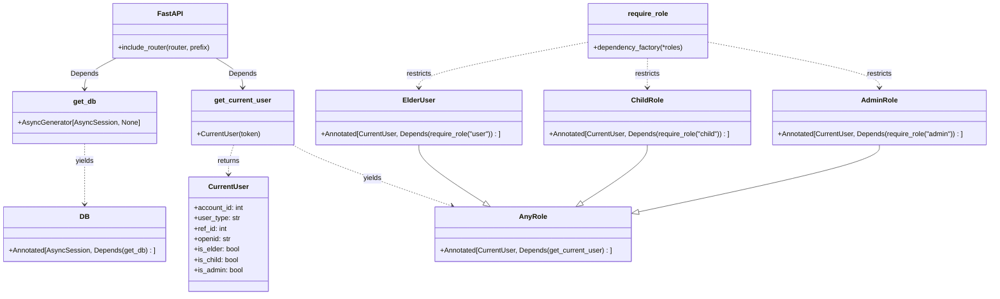
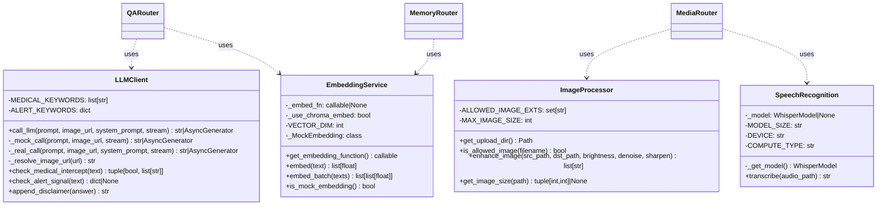
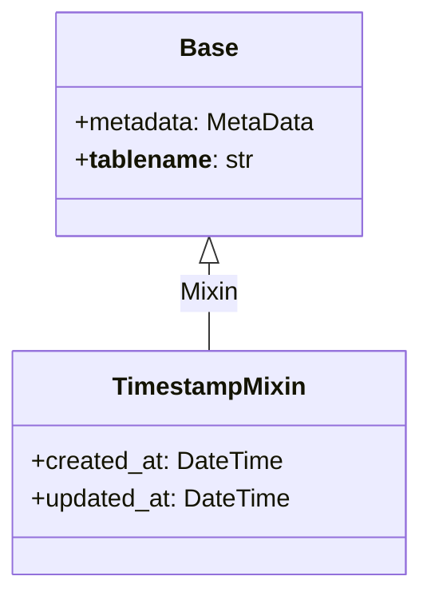
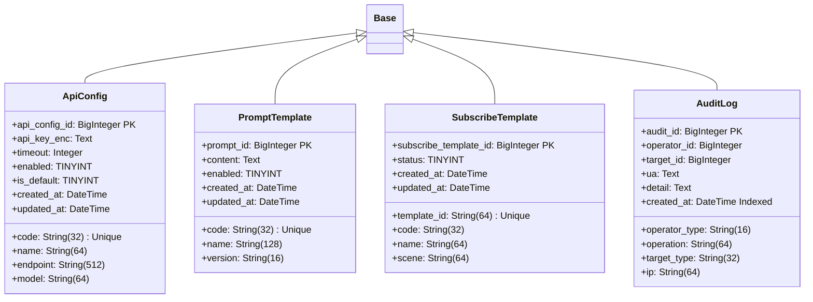
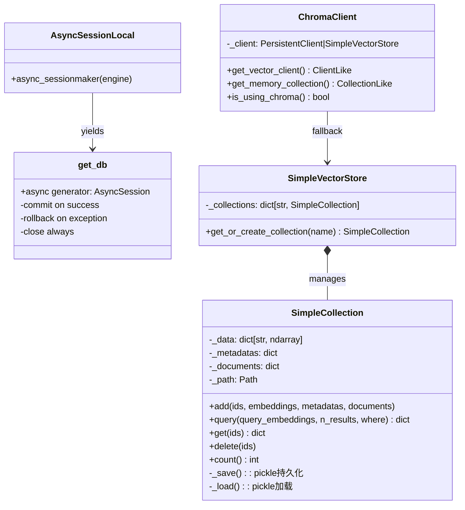
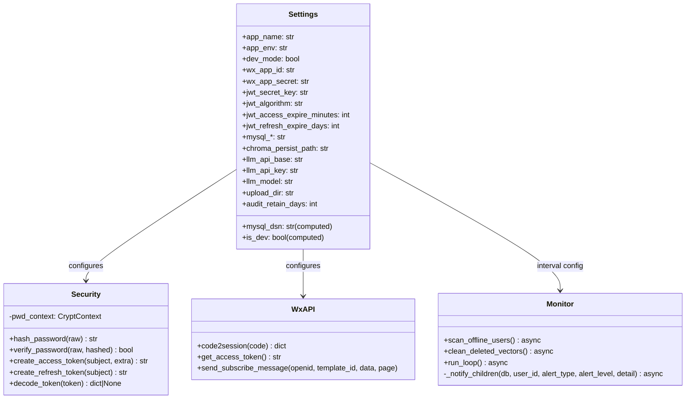
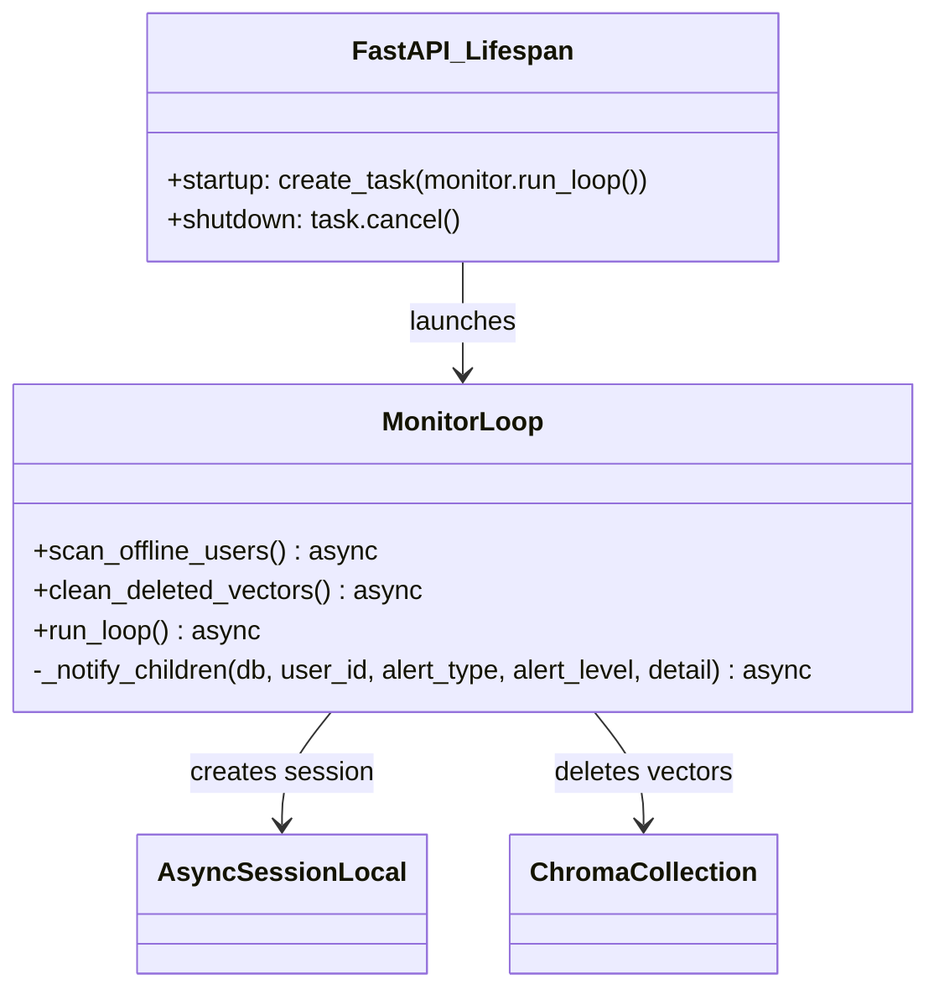

# 模糊视觉辅助问答系统 详细设计文档 V2.0

## 第五部分 单元模块设计

---

### 一、后端API控制层类图设计

后端基于FastAPI框架，采用按业务域拆分的路由模块化设计，所有路由通过FastAPI依赖注入系统获取数据库会话和当前用户身份。

#### 1、API控制层类图

```mermaid
classDiagram
    class APIRouter {
        +prefix: str
        +tags: list[str]
        +include_router(router)
    }

    class HealthRouter {
        +GET /health → health()
        +GET /info → info()
    }

    class AuthRouter {
        +POST /auth/wx-login → wx_login(payload, db)
        +POST /auth/refresh → refresh_token(payload, db)
        +POST /auth/logout → logout(cur)
        +POST /auth/admin/login → admin_login(payload, db)
        +POST /auth/bind-phone → bind_phone(payload, cur, db)
        +POST /auth/subscribe/grant → report_subscribe_grant(payload, cur, db)
        +GET /auth/dev/create-admin → dev_create_admin(db)
        +POST /auth/heartbeat → heartbeat(cur, db)
    }

    class MediaRouter {
        +POST /media/upload/image → upload_image(file, cur)
        +POST /media/image/enhance → enhance_image_endpoint(payload, cur)
        +POST /media/upload/voice → upload_voice(file, cur)
    }

    class QARouter {
        +POST /qa/ask → ask(payload, cur, db)
        +WS /qa/stream/{task_id} → qa_stream(ws, task_id)
        +GET /qa/history → history(cur, db, query)
        +GET /qa/history/{msg_id} → history_detail(msg_id, cur, db)
    }

    class MemoryRouter {
        +GET /memory → list_memory(cur, db, query)
        +POST /memory → create_memory(payload, cur, db)
        +GET /memory/{memory_id} → get_memory(memory_id, cur, db)
        +PUT /memory/{memory_id} → update_memory(memory_id, payload, cur, db)
        +DELETE /memory/{memory_id} → delete_memory(memory_id, cur, db)
        +PATCH /memory/{memory_id}/importance → set_importance(memory_id, payload, cur, db)
        +POST /memory/search → search_memory(payload, cur, db)
    }

    class AlertRouter {
        +POST /alert/emergency/call → emergency_call(cur, db)
    }

    class ReminderRouter {
        +GET /reminder/medication → my_medications(cur, db)
    }

    APIRouter *-- HealthRouter : include
    APIRouter *-- AuthRouter : include
    APIRouter *-- MediaRouter : include
    APIRouter *-- QARouter : include
    APIRouter *-- MemoryRouter : include
    APIRouter *-- AlertRouter : include
    APIRouter *-- ReminderRouter : include
```

#### 2、依赖注入类图



#### 3、类的详细设计描述

##### 3.1 HealthRouter

详细描述：位于`app/api/v1/health.py`，提供系统健康检查接口，无需鉴权即可访问。包含两个端点：
`GET /health`返回服务名称、运行环境和开发模式标志，供运维监控使用。
`GET /info`返回API版本、前缀和文档地址（Swagger/Redoc），供前端开发人员定位API文档。

##### 3.2 AuthRouter

详细描述：位于`app/api/v1/auth.py`，是系统身份认证的核心模块，标签为`auth`，共暴露八个接口端点，覆盖微信小程序登录、JWT令牌管理、管理员登录、订阅消息授权记录和心跳上报的完整生命周期。
`POST /auth/wx-login`接收WxLoginIn（code、user_type），DEV模式下code可传任意字符串作为mock openid。流程为调用wx.code2session获取openid→查询wx_account表（不存在则自动创建WxAccount+User/ChildUser记录）→签发access_token（30分钟）和refresh_token（7天）→更新last_login_at→返回TokenOut。
`POST /auth/refresh`接收RefreshIn（refresh_token），解码校验后重新签发access_token，实现静默续期。
`POST /auth/logout`接收AnyRole身份，写入audit_log审计记录后返回成功，前端清除本地token完成登出。
`POST /auth/admin/login`接收AdminLoginIn（username、password），bcrypt哈希比对后签发user_type="admin"的JWT。
`POST /auth/bind-phone`接收BindPhoneIn（phone），要求ChildRole身份，更新child_user表phone字段。
`POST /auth/subscribe/grant`接收SubscribeGrantIn（template_code、grant_status、expire_count），写入subscribe_grant表记录微信订阅消息授权结果。
`GET /auth/dev/create-admin`仅在DEV模式可用，创建默认管理员账号admin/admin。
`POST /auth/heartbeat`接收ElderUser身份，更新user表last_heartbeat_at和online_status为online。若检测到从offline恢复则响应was_offline=true。辅助函数`_create_network_alert()`在检测到异常时创建alert_event并推送子女订阅消息。

##### 3.3 MediaRouter

详细描述：位于`app/api/v1/media.py`，标签为`media`，处理图片和语音文件的上传与处理。核心理念为"上传即处理"。
`POST /media/upload/image`接收multipart/form-data图片文件，校验扩展名（jpg/png/bmp/webp）、大小不超过10MB，通过后以UUID文件名保存原始文件，调用image_processor.enhance_image()执行Gamma亮度增强（默认brightness=1.3），返回原图和增强图的URL及分辨率。
`POST /media/image/enhance`接收ImageEnhanceIn（media_id或图片URL、brightness参数），手动重新执行Gamma校正。
`POST /media/upload/voice`接收multipart/form-data语音文件，校验扩展名（wav/mp3/m4a/aac/amr）、大小不超过25MB，通过后保存原始文件，调用speech_recognition.transcribe()执行Whisper语音转文本，返回音频URL、asr_text转写文本和时长。

##### 3.4 QARouter

详细描述：位于`app/api/v1/qa.py`，标签为`qa`，是系统核心业务模块，实现完整的多模态智能问答处理管线（参数校验→上下文组装→Prompt模板获取→大模型API调用→医疗合规拦截→预警信号检测→数据库落库→订阅消息推送），同时提供同步HTTP和WebSocket流式两种问答模式。
`POST /qa/ask`接收QAAskIn（input_type、text、media_url、session_id），返回QAAskOut（msg_id、session_id、answer、cat_action、intercepted、risk_tags、alert_signal）。辅助函数`_resolve_target_user()`按角色解析查询目标老人ID，`_notify_children_alert()`向绑定子女推送预警订阅消息。
`WS /qa/stream/{task_id}`通过WebSocket协议实现流式问答，定义五种action帧类型：listen、speak、think、alert_signal、done，文本以chunk帧逐片推送。
`GET /qa/history`支持input_type、keyword、start_date、end_date多维度筛选的分页历史查询。
`GET /qa/history/{msg_id}`返回单条消息的完整详情（含提问文本、原始/增强图片URL、ASR文字、回答文本、风险标签、拦截标志、延迟毫秒数）。

##### 3.5 MemoryRouter

详细描述：位于`app/api/v1/memory.py`，标签为`memory`，管理长期记忆的完整生命周期和RAG语义检索。模块级常量`COLLECTION_NAME = "long_term_memory"`定义了Chroma中的集合名称。
`GET /memory`支持按user_id、memory_type、source、importance、keyword多维筛选的分页列表查询，按importance降序排列。
`POST /memory`接收MemoryIn（user_id、memory_type、content、summary、importance、source），执行双写流程：写入MySQL long_term_memory表→调用`_add_to_chroma()`将内容向量化写入Chroma。
`GET /memory/{memory_id}`返回单条记忆的完整字段。
`PUT /memory/{memory_id}`编辑记忆，内容变更时重新向量化并更新Chroma。
`DELETE /memory/{memory_id}`执行软删除（is_deleted=1），向量物理清理由定时任务异步执行。
`PATCH /memory/{memory_id}/importance`单独调整重要度（1-5）。
`POST /memory/search`接收MemorySearchIn（query、top_k、user_id、memory_type），执行语义检索：embed文本→Chroma余弦相似度检索→MySQL回查完整记录→按importance和相似度排序。Chroma不可用时降级为MySQL LIKE模糊搜索。

##### 3.6 AlertRouter

详细描述：位于`app/api/v1/alert.py`，标签为`alert`，处理老人端主动触发的一键紧急呼叫。
`POST /alert/emergency/call`接收ElderUser身份，创建AlertEvent（alert_type="紧急呼叫"，alert_level="紧急"，trigger_source="manual"），通过辅助函数`_notify_children()`遍历所有绑定子女推送alert.urgent订阅消息模板，写入communication_log通信记录，返回受通知的子女数量。

##### 3.7 ReminderRouter

详细描述：位于`app/api/v1/reminder.py`，标签为`reminder`，为老人端提供用药提醒只读查询接口。
`GET /reminder/medication`接收ElderUser身份，以user_id和active=1为条件查询medication_reminder表，按remind_time升序排列，返回药品名称、剂量、提醒时间和定时表达式。

---

### 二、后端服务层类图设计

服务层封装系统的核心业务逻辑，位于API控制层之下、数据访问层之上，各服务模块职责单一、边界清晰。

#### 1、服务层类图



#### 2、类的详细设计描述

##### 2.1 LLMClient

详细描述：位于`app/services/llm_client.py`，封装对外部大模型API的全部调用逻辑，支持OpenAI兼容接口（ChatGPT、DeepSeek、通义千问、Kimi Chat等）。模块内部实现DEV/PROD双模式切换、医疗合规拦截后处理和预警信号检测后处理三道管线。模块级常量`MEDICAL_KEYWORDS`（药品/药片/胶囊/剂量/mg/副作用等涉医关键词列表）和`ALERT_KEYWORDS`（跌倒→警告/救命→紧急/难受→警告等映射字典）定义了拦截和预警的规则库。
`call_llm(prompt, image_url, system_prompt, stream)`根据`settings.llm_api_key`是否有值路由到`_mock_call`或`_real_call`。
`_mock_call(prompt, image_url, stream)`在DEV模式下生成预设固定话术，模拟0.3秒延迟，命中MEDICAL_KEYWORDS时追加免责声明，stream=True时逐字符异步yield。
`_real_call(prompt, image_url, system_prompt, stream)`通过httpx.AsyncClient发送POST请求至大模型API端点，构造OpenAI vision格式消息体（支持图片URL内嵌），流式模式解析SSE事件流逐块yield。
`check_medical_intercept(text)`返回(是否命中, 命中关键词列表)，`check_alert_signal(text)`返回预警信号字典或None，`append_disclaimer(answer)`在涉医回答末尾追加"以上内容仅供参考，请遵医嘱"。

##### 2.2 ImageProcessor

详细描述：位于`app/services/image_processor.py`，基于OpenCV+Pillow的图像预处理服务。针对老年人拍照偏暗、图像模糊等低质量问题提供自动亮度增强。模块级常量`ALLOWED_IMAGE_EXTS = {".jpg", ".jpeg", ".png", ".bmp", ".webp"}`和`MAX_IMAGE_SIZE = 10*1024*1024`定义了文件校验规则。
`enhance_image(src_path, dst_path, brightness, denoise, sharpen)`是核心增强函数。用OpenCV读取图片（失败时Pillow兜底），执行Gamma校正变换：`output = 255*(input/255)^(1/brightness)`，brightness>1时gamma<1，暗部提得多、亮部提得少。denoise和sharpen参数已声明但标记为TODO。返回执行的操作列表。
`get_upload_dir()`返回`data/uploads`目录绝对路径，不存在则自动创建。`is_allowed_image(filename)`检查文件扩展名。`get_image_size(path)`通过Pillow获取图片宽高。

##### 2.3 SpeechRecognition

详细描述：位于`app/services/speech_recognition.py`，基于faster-whisper库的语音转文本服务。采用懒加载单例模式，模型在首次调用时加载并常驻内存。模块级常量`MODEL_SIZE="small"`（约500MB参数，中英文识别精度与速度平衡）、`DEVICE="cpu"`（兼容无GPU服务器）、`COMPUTE_TYPE="int8"`（INT8量化降低内存）。
`_get_model()`是模型单例工厂，首次调用时下载Whisper small模型至`~/.cache/whisper/`目录。
`transcribe(audio_path)`是主入口函数。调用`model.transcribe(audio_path, language="zh", beam_size=5, vad_filter=True)`设置中文、beam搜索宽度5、启用VAD静音过滤（500ms阈值），拼接所有segments的text返回完整转写文本。文件不存在或识别失败返回空字符串。

##### 2.4 EmbeddingService

详细描述：位于`app/services/embedding.py`，为RAG语义检索提供文本到向量的转换服务。向量维度固定为384。采用分层策略：优先使用chromadb内置的all-MiniLM-L6-v2 Sentence Transformer模型，不可用时降级为基于numpy的确定性哈希向量。
`get_embedding_function()`是单例工厂函数。优先路径：若chromadb可用则使用`DefaultEmbeddingFunction`；降级路径：使用内部类`_MockEmbedding`，该类对文本计算SHA256哈希作为numpy随机种子，生成L2归一化的384维确定性向量。
`embed(text)`将单段文本转为384维浮点数向量。`embed_batch(texts)`依次对列表元素调用embed。`is_mock_embedding()`返回当前是否使用降级方案。

---

### 三、后端数据访问层类图设计

数据访问层为整个后端提供统一的结构化数据持久化和向量数据存储能力，包含ORM模型层和数据库会话管理层两大组件。

#### 1、ORM声明式基类与混入类类图



#### 2、用户系统模型类图

```mermaid
classDiagram
    class WxAccount {
        +account_id: BigInteger PK
        +openid: String(64) Indexed
        +unionid: String(64)
        +session_key: Text
        +user_type: String(16)
        +ref_user_id: BigInteger
        +last_login_at: DateTime
    }

    class User {
        +user_id: BigInteger PK
        +nickname: String(64)
        +avatar_url: String(512)
        +birth_date: Date
        +gender: TINYINT
        +wx_account_id: BigInteger FK
        +status: TINYINT
        +last_heartbeat_at: DateTime Indexed
        +online_status: String(16)
    }

    class ChildUser {
        +child_id: BigInteger PK
        +name: String(64)
        +phone: String(20) Unique Indexed
        +email: String(128)
        +wx_account_id: BigInteger FK
        +password_hash: String(256)
        +relation: String(64)
    }

    class UserChildRelation {
        +relation_id: BigInteger PK
        +user_id: BigInteger FK
        +child_id: BigInteger FK
        +relation: String(32)
        +is_primary: TINYINT
    }

    class AdminUser {
        +admin_id: BigInteger PK
        +username: String(64) Unique
        +password_hash: String(256)
        +role: String(16)
    }

    Base <|-- WxAccount
    Base <|-- User
    Base <|-- ChildUser
    Base <|-- UserChildRelation
    Base <|-- AdminUser
    WxAccount ||--o| User : ref_user_id
    WxAccount ||--o| ChildUser : ref_user_id
    User ||--o{ UserChildRelation : user_id
    ChildUser ||--o{ UserChildRelation : child_id
```

#### 3、消息与记忆模型类图

```mermaid
classDiagram
    class Message {
        +msg_id: BigInteger PK
        +user_id: BigInteger FK
        +session_id: String(64) Indexed
        +role: String(16)
        +input_type: String(16)
        +content_text: Text
        +content_media_url: Text
        +processed_media_url: Text
        +asr_text: Text
        +answer_text: Text
        +prompt_id: BigInteger FK
        +api_config_id: BigInteger FK
        +intercepted: TINYINT
        +risk_tags: JSON
        +latency_ms: Integer
        +status: String(16)
        +created_at: DateTime
        +updated_at: DateTime
    }

    class LongTermMemory {
        +memory_id: BigInteger PK
        +user_id: BigInteger FK Nullable
        +memory_type: String(32)
        +source: String(16)
        +content: Text
        +summary: Text
        +vector_id: String(64) Indexed
        +importance: TINYINT
        +source_msg_id: BigInteger FK
        +is_deleted: TINYINT
        +created_at: DateTime
        +updated_at: DateTime
    }

    Base <|-- Message
    Base <|-- LongTermMemory
    Message ||--o{ LongTermMemory : source_msg_id
```

#### 4、用户画像模型类图

```mermaid
classDiagram
    class UserProfile {
        +profile_id: BigInteger PK
        +user_id: BigInteger FK Unique
        +health_tags: JSON
        +medication_habits: JSON
        +lifestyle_pattern: JSON
        +overall_weight: DECIMAL(5,2)
        +rebuilt_at: DateTime
        +created_at: DateTime
        +updated_at: DateTime
    }

    class UserProfileDimension {
        +dim_id: BigInteger PK
        +profile_id: BigInteger FK Indexed
        +dim_code: String(64)
        +dim_value: DECIMAL(8,2)
        +weight: DECIMAL(5,2)
        +decay_factor: DECIMAL(3,2)
        +created_at: DateTime
        +updated_at: DateTime
    }

    Base <|-- UserProfile
    Base <|-- UserProfileDimension
    UserProfile ||--o{ UserProfileDimension : profile_id
```

#### 5、交互追踪模型类图

```mermaid
classDiagram
    class BehaviorTrace {
        +trace_id: BigInteger PK
        +user_id: BigInteger FK
        +trace_time: DateTime Indexed
        +trace_type: String(32)
        +content_summary: Text
        +identified_object: String(128)
        +risk_level: String(8)
    }

    class AlertEvent {
        +alert_id: BigInteger PK
        +user_id: BigInteger FK
        +alert_type: String(32)
        +alert_level: String(8)
        +trigger_source: String(16)
        +trigger_msg_id: BigInteger FK
        +alert_time: DateTime Indexed
        +detail: Text
        +handling_status: String(16)
        +handled_by: BigInteger FK
        +handled_at: DateTime
        +handle_remark: Text
        +notify_channels: JSON
        +created_at: DateTime
        +updated_at: DateTime
    }

    class CommunicationLog {
        +comm_id: BigInteger PK
        +child_id: BigInteger FK
        +user_id: BigInteger FK
        +comm_type: String(16)
        +direction: String(16)
        +content: Text
        +duration_sec: Integer
        +comm_time: DateTime Indexed
    }

    class SettingChange {
        +change_id: BigInteger PK
        +child_id: BigInteger FK
        +user_id: BigInteger FK
        +setting_key: String(64)
        +old_value: Text
        +new_value: Text
        +change_time: DateTime
        +sync_status: String(16)
    }

    class UserSetting {
        +user_id: BigInteger PK FK
        +setting_key: String(64) PK
        +setting_value: Text
        +synced_at: DateTime
    }

    class MedicationReminder {
        +reminder_id: BigInteger PK
        +user_id: BigInteger FK
        +drug_name: String(128)
        +dosage: String(64)
        +remind_time: String(8)
        +cron_expr: String(64)
        +active: TINYINT
        +created_at: DateTime
        +updated_at: DateTime
    }

    class GreetingSchedule {
        +greeting_id: BigInteger PK
        +user_id: BigInteger FK
        +child_id: BigInteger FK
        +content: Text
        +cron_expr: String(64)
        +active: TINYINT
        +created_at: DateTime
        +updated_at: DateTime
    }

    class SubscribeGrant {
        +grant_id: BigInteger PK
        +account_id: BigInteger FK
        +template_id: BigInteger
        +grant_status: String(16)
        +granted_at: DateTime
        +expire_count: Integer
        +created_at: DateTime
        +updated_at: DateTime
    }

    Base <|-- BehaviorTrace
    Base <|-- AlertEvent
    Base <|-- CommunicationLog
    Base <|-- SettingChange
    Base <|-- UserSetting
    Base <|-- MedicationReminder
    Base <|-- GreetingSchedule
    Base <|-- SubscribeGrant
```



#### 6、配置与审计模型类图



#### 7、数据库会话与向量存储类图



#### 8、核心配置与安全类图



---

### 四、老人端微信小程序类图设计

老人端小程序（"喵喵助手"）采用微信原生小程序框架，核心设计理念为适老化极简交互。

#### 1、老人端总体类图

```mermaid
classDiagram
    class App {
        +globalData: Object
        +onLaunch()
    }

    class IndexPage {
        +onShow()
        +onLogin()
    }

    class HomePage {
        +data: {reminders, catImage}
        +onShow()
        +onHide()
        +onUnload()
        +fetchReminders()
        +onGoChat()
        +onGoReminder()
        +onGoEmergency()
        +onGoSettings()
        -heartbeatTimer: number
        -reminderTimer: number
    }

    class ChatPage {
        +data: {recordState, catState, messages, sessionId, statusText, waveActive}
        +onLoad()
        +onUnload()
        +onMicStart(e)
        +onMicEnd(e)
        +onCameraTap()
        +onCancelTap()
        +onBubbleTap(e)
        +onEmergencyTap()
        +onRetry(e)
        +sendToQA(inputType, text, mediaUrl)
        +handleVoiceUpload(voicePath)
        +handleImageUpload(imagePath)
        -recorderManager: RecorderManager
        -cameraContext: CameraContext
        -midFrameTimer: number
    }

    class ReminderPage {
        +data: {reminderList}
        +onShow()
    }

    class EmergencyPage {
        +data: {calling}
        +onEmergencyCall()
        +onCall120()
    }

    class SettingsPage {
        +data: {fontSize, voiceEnabled}
        +onShow()
        +onFontSizeChange()
        +onVoiceToggle()
        +onLogout()
    }

    class ChatBubble {
        +properties: {role, type, content, status, catState, riskTags, intercepted, messageId}
        +observers: {catState, content.images}
        +onBubbleTap()
        +onErrorTap()
        +previewImage(e)
    }

    class Request {
        +BASE_URL: string
        +request(options) Promise
        +getFullUrl(path) string
    }

    class Upload {
        +uploadImage(filePath) Promise
        +uploadVoice(filePath) Promise
        -uploadFile(filePath, type) Promise
    }

    class Auth {
        +login() Promise
        +restoreToken() bool
        +sendHeartbeat() Promise
        +startHeartbeat()
        +stopHeartbeat()
        +isTokenValid() bool
    }

    class Speech {
        +speak(text) Promise
        +stopSpeak()
        +replayLast()
        -lastText: string
    }

    class Storage {
        +set(key, value)
        +get(key, defaultValue) any
        +remove(key)
        +clear()
    }

    App *-- IndexPage
    App *-- HomePage
    App *-- ChatPage
    App *-- ReminderPage
    App *-- EmergencyPage
    App *-- SettingsPage
    App *-- Request
    App *-- Auth
    ChatPage *-- ChatBubble
    ChatPage ..> Upload : uses
    ChatPage ..> Speech : uses
    HomePage ..> Speech : uses
    HomePage ..> Auth : uses
    IndexPage ..> Auth : uses
    SettingsPage ..> Storage : uses
    Speech ..> Storage : uses
    Request ..> Auth : token
```

#### 2、类的详细设计描述

##### 2.1 App全局应用

详细描述：位于`app.js`。`globalData`维护baseUrl、token、refreshToken、refId、nickname五个全局状态字段，在onLaunch中初始化，所有页面通过`getApp()`共享访问。

##### 2.2 IndexPage登录引导页

详细描述：位于`pages/index/index`。`onShow()`时调用auth.restoreToken()尝试恢复登录态，有效token则直接redirectTo首页跳转。`onLogin()`执行微信一键登录流程：wx.login→auth.login→持久化token→redirectTo首页。

##### 2.3 HomePage首页仪表盘

详细描述：位于`pages/home/home`。`onShow()`时校验token有效性，启动30秒heartbeat心跳和5分钟reminder轮询。`fetchReminders()`对比本次与上次缓存的提醒ID列表，发现新增提醒时调用speech.speak()语音播报。`onHide()`和`onUnload()`清理定时器资源。四个导航方法跳转至chat/reminder/emergency/settings页面。

##### 2.4 ChatPage多模态智能聊天页

详细描述：位于`pages/chat/chat`，核心交互页面。四层结构：全屏camera后置摄像头取景→半透明深色遮罩→对话气泡scroll-view→底部操作栏。状态变量recordState（idle/recording/uploading/thinking）控制交互流程，catState（listen/think/speak）控制小猫动画。`onMicStart()`开始录音+拍首帧照片+设midFrameTimer拍中帧。`onMicEnd()`停止录音+拍尾帧→upload上传图片和语音→`sendToQA()`发送问答请求→speech.speak()语音播报回答。`onCameraTap()`单独拍照暂存。`onCancelTap()`中止当前操作。`sendToQA()`构造user消息→POST /qa/ask→解析回答→追加assistant消息→TTS播报→更新sessionId。

##### 2.5 ChatBubble对话气泡组件

详细描述：位于`components/chat-bubble`，老人端唯一自定义组件。接收八个properties：role、type、content（{text, images}）、status、catState、riskTags、intercepted、messageId。observers监听catState映射橘猫图片，监听content.images拼接完整URL。根据role渲染左对齐（assistant+猫头像）或右对齐（user）布局。status=sending显示三点loading动画，status=error显示红色重试按钮。intercepted=true时显示黄色免责声明。

##### 2.6 Request网络请求工具

详细描述：位于`utils/request.js`。`request(options)`自动从app.globalData获取token注入Authorization头，调用wx.request，统一处理code==0成功展开data字段、code!=0展示错误Toast、HTTP 401跳转登录页、网络异常展示提示。`getFullUrl(path)`拼接BASE_URL与相对路径。

##### 2.7 Upload文件上传工具

详细描述：位于`utils/upload.js`。`uploadImage(filePath)`调用wx.uploadFile上传至/api/v1/media/upload/image，`uploadVoice(filePath)`上传至/api/v1/media/upload/voice，文件名统一为"file"，超时60秒。

##### 2.8 Auth鉴权工具

详细描述：位于`utils/auth.js`。`login()`串联wx.login获取code→wx.request登录→持久化token到Storage和globalData。`restoreToken()`从Storage恢复token到globalData。`startHeartbeat()`启动30秒间隔的POST /auth/heartbeat定时器。

##### 2.9 Speech语音播报工具

详细描述：位于`utils/speech.js`，基于WechatSI插件（wx069ba97219f66d99）。`speak(text)`先检查voiceEnabled开关，再调用plugin.textToSpeech合成mp3，通过wx.createInnerAudioContext播放。`stopSpeak()`停止销毁播放实例。`replayLast()`重播上次文本。

##### 2.10 Storage本地存储工具

详细描述：位于`utils/storage.js`。封装wx.setStorageSync/getStorageSync/removeStorageSync/clearStorageSync，所有key自动添加"gimi_"前缀。

---

### 五、子女端微信小程序类图设计

子女端小程序（"孝心守护"）同为原生微信小程序框架，采用Tab Bar三页主结构+三个分包按需加载的架构，当前处于骨架实现阶段。

#### 1、子女端总体类图

```mermaid
classDiagram
    class App {
        +globalData: Object
        +onLaunch()
        +onShow()
        +onHide()
        +getToken() string
        +setToken(token)
        +getUserId() int
        +getNickname() string
        +getBoundElderlyId() int
        +setBoundElderlyId(id)
        +getBoundElderlyName() string
        +setBoundElderlyName(name)
        +startHeartbeat()
        +stopHeartbeat()
    }

    class ApiClient {
        +BASE_URL: string
        +request(options) Promise
        +get(url, params) Promise
        +post(url, data) Promise
        +put(url, data) Promise
        +patch(url, data) Promise
        +del(url) Promise
        -refreshQueue: array
        -isRefreshing: bool
        -refreshToken() Promise
        -clearLogin()
    }

    class ApiEndpoints {
        +login(code, userType) Promise
        +heartbeat() Promise
        +bindElderly(userId, relation) Promise
        +unbindElderly(userId) Promise
        +getBindedUsers() Promise
        +getDashboard(userId) Promise
        +getMessages(userId, params) Promise
        +getSettings(userId) Promise
        +updateSettings(userId, data) Promise
        +getSettingChanges(userId) Promise
        +getAlerts(params) Promise
        +handleAlert(alertId, data) Promise
        +getMemory(params) Promise
        +createMemory(data) Promise
        +deleteMemory(memoryId) Promise
    }

    class IndexPage {
        +data: {isBound, boundName}
        +onShow()
        +onNavTo(page)
    }

    class AlertPage {
        +data: {isBound}
        +onShow()
        +onPullDownRefresh()
    }

    class ProfilePage {
        +data: {nickname, boundName}
        +onShow()
        +logout()
    }

    class BindPage {
        +data: {bindCode}
        +onLoad()
    }

    class HealthPage {
        +data: {isBound}
        +onShow()
    }

    class MedicationPage {
        +data: {isBound}
        +onShow()
    }

    class TracePage {
        +data: {isBound}
        +onShow()
    }

    class MessagePage {
        +data: {isBound}
        +onShow()
    }

    class GreetingPage {
        +data: {isBound}
        +onShow()
    }

    class HistoryPage {
        +data: {isBound}
        +onShow()
    }

    class SettingsPage {
        +data: {isBound}
        +onShow()
    }

    class KnowledgePage {
        +data: {isBound}
        +onShow()
    }

    App *-- IndexPage : Tab Bar
    App *-- AlertPage : Tab Bar
    App *-- ProfilePage : Tab Bar
    App *-- BindPage : subpkg-manage
    App *-- HealthPage : subpkg-health
    App *-- MedicationPage : subpkg-health
    App *-- TracePage : subpkg-health
    App *-- MessagePage : subpkg-care
    App *-- GreetingPage : subpkg-care
    App *-- HistoryPage : subpkg-care
    App *-- SettingsPage : subpkg-manage
    App *-- KnowledgePage : subpkg-manage
    App ..> ApiClient : globalData
    ApiEndpoints ..> ApiClient : extends
    IndexPage ..> ApiEndpoints : api.*
    AlertPage ..> ApiEndpoints : api.*
```

#### 2、类的详细设计描述

##### 2.1 App全局应用

详细描述：位于`app.js`。`globalData`维护token、refreshToken、userId、nickname、userType、sessionId、boundElderlyId、boundElderlyName等全局状态。在onLaunch时从Storage恢复持久化数据。onShow时启动30秒心跳，onHide时停止。提供getToken/setToken、getBoundElderlyId/setBoundElderlyId等全局状态读写方法，确保globalData和Storage保持同步。

##### 2.2 ApiClient HTTP请求层

详细描述：位于`utils/api.js`。`request(options)`从wx.getStorageSync('token')读取token注入Authorization头，超时15秒。成功且code==0时展开data字段返回。HTTP 401时自动触发token刷新机制：使用`refreshQueue`队列和`isRefreshing`标志防止并发刷新，调用`refreshToken()`向/api/v1/auth/refresh获取新token后重试原始请求。刷新失败则调用`clearLogin()`清空存储。还提供get/post/put/patch/del快捷方法。

##### 2.3 ApiEndpoints接口封装层

详细描述：位于`utils/api.js`中的api对象，封装了所有后端API调用。包含15个方法：login（微信登录）、heartbeat（心跳保活）、bindElderly（绑定老人）、unbindElderly（解除绑定）、getBindedUsers（已绑定列表）、getDashboard（健康仪表盘）、getMessages（消息记录）、getSettings/updateSettings（远程配置读写）、getSettingChanges（配置变更历史）、getAlerts（预警列表）、handleAlert（处理预警）、getMemory（知识库查询）、createMemory（新增知识）、deleteMemory（删除知识）。

##### 2.4 IndexPage首页仪表盘

详细描述：位于`pages/index/index`，Tab Bar首个标签页。onShow时检查boundElderlyId判断绑定状态：未绑定时显示绑定引导卡片，已绑定时展示功能导航网格（健康画像、用药提醒、行为轨迹、亲情通信、定时问候、问答历史、远程配置、知识库管理）。

##### 2.5 AlertPage预警中心

详细描述：位于`pages/alert/alert`，Tab Bar第二个标签页。展示当前绑定老人的预警事件列表，支持下拉刷新。

##### 2.6 ProfilePage个人中心

详细描述：位于`pages/profile/profile`，Tab Bar第三个标签页。展示用户昵称和已绑定老人姓名。`logout()`清空wx.Storage和app.globalData后重新启动应用。

##### 2.7 分包页面

详细描述：HealthPage（健康画像）、MedicationPage（用药提醒）、TracePage（行为轨迹）位于subpkg-health分包；MessagePage（亲情通信）、GreetingPage（定时问候）、HistoryPage（问答历史）位于subpkg-care分包；BindPage（绑定管理）、SettingsPage（远程配置）、KnowledgePage（知识库管理）位于subpkg-manage分包。各页面当前均为骨架占位实现——onShow时检查绑定状态，UI布局和导航已完整定义，数据获取逻辑待后端接口就绪后对接。

---

### 六、后端定时任务模块类图设计

定时任务模块负责后台周期性任务的调度执行，使用asyncio原生协程实现事件循环驱动的定时器，在FastAPI的lifespan生命周期中启动和关闭。

#### 1、定时任务类图



#### 2、类的详细设计描述

详细描述：`scan_offline_users()`每60秒执行一次。查询user表中online_status='online'且last_heartbeat_at超过180秒的记录，将online_status更新为offline，创建alert_type="网络断开"、alert_level="警告"、trigger_source="rule"的AlertEvent，在写入前检查是否已存在待处理的同类型预警防止重复创建，随后通过`_notify_children()`向所有绑定子女推送alert.warn订阅消息模板。

`clean_deleted_vectors()`每3600秒执行一次。查询long_term_memory表中is_deleted=1且vector_id非空的记录（limit 500），调用Chroma的collection.delete()物理删除向量后将vector_id置NULL。此异步清理设计避免了同步删除对API响应时间的性能影响。

`run_loop()`通过while True + asyncio.sleep()实现周期性调度。在FastAPI的lifespan中通过`asyncio.create_task(monitor.run_loop())`启动为后台协程任务，收到关闭信号时`task.cancel()`优雅退出。
